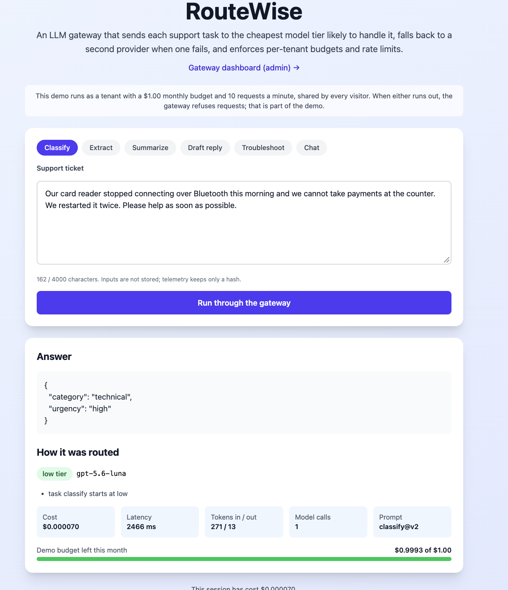
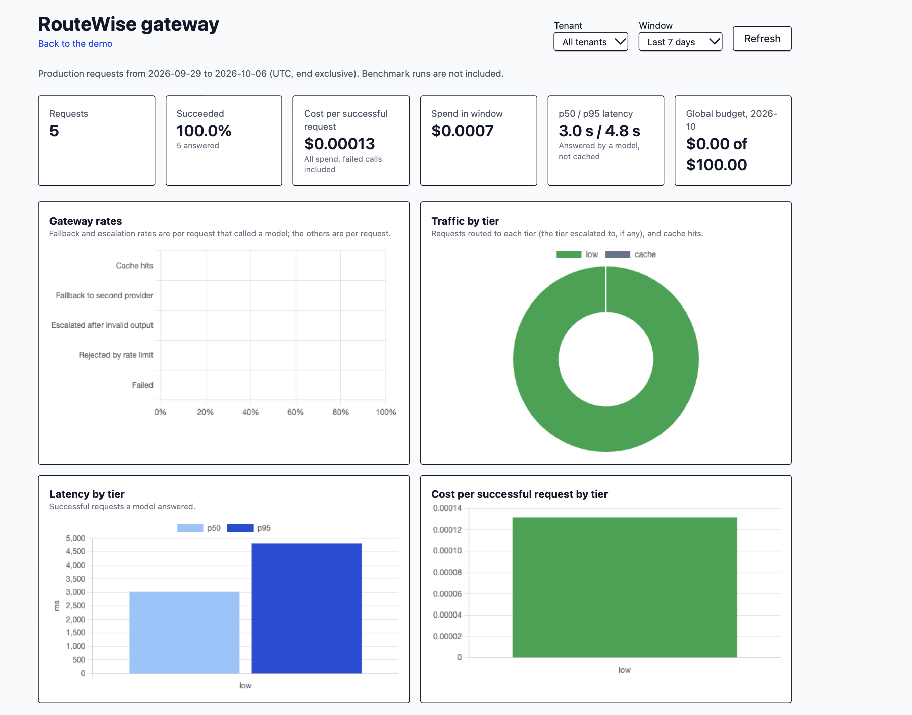
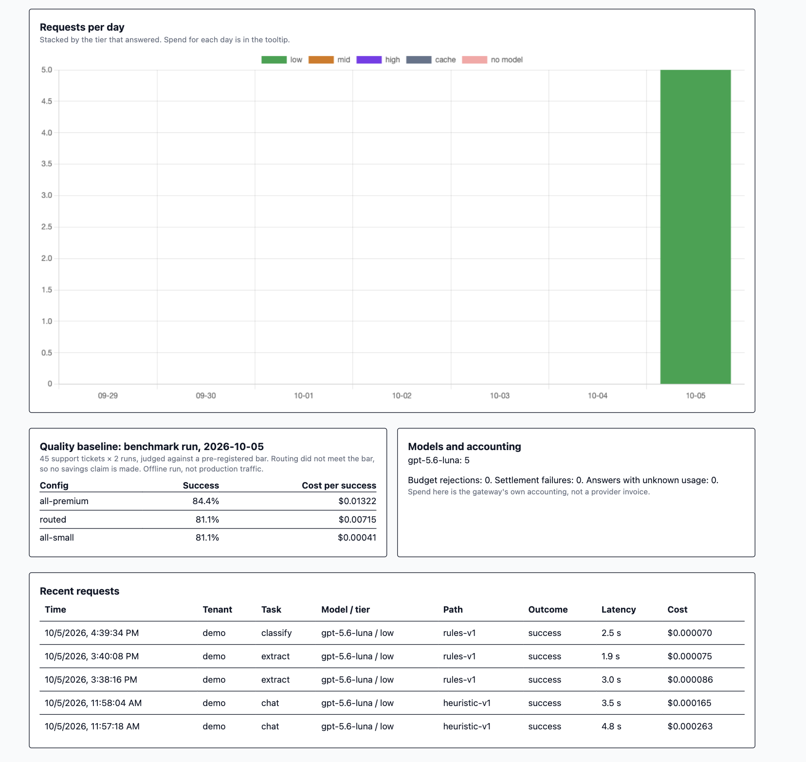
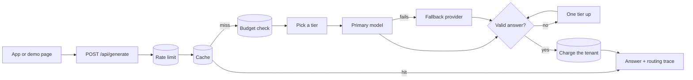

# RouteWise

**An LLM gateway that sends each support request to the cheapest model that can handle it.**

Live demo: **[route-wise-six.vercel.app](https://route-wise-six.vercel.app)**

Most customer-support work is routine: tagging a ticket, pulling an order number out of an email, summarizing a thread. A small, cheap model does that well. Some tickets are hard, like a payment failing for reasons the customer can't explain, and those deserve a bigger model. Sending everything to the biggest model is simple but expensive. Sending everything to the smallest one is cheap but fails the hard tickets.

RouteWise sits between an app and the model providers and makes that choice per request. Behind one API endpoint it:

- **routes** each request to a low, mid or high model tier, and says why;
- **recovers** from provider failures by retrying, then falling back from OpenAI to Anthropic;
- **checks** structured answers against a schema and retries one tier up if they fail;
- **caches** answers, so repeating a question costs nothing;
- **enforces** each customer's monthly budget and rate limits in Postgres, exactly, even under heavy concurrency;
- **records** every request and every provider call, with its cost and latency.

I then measured it: a pre-registered experiment on whether routing keeps answer quality, and a load test of the database path.

## Try it

The [demo page](https://route-wise-six.vercel.app) runs any of six support tasks through the real gateway. Pick a sample ticket or write your own, and it shows the answer plus how it was routed: the tier and model, the reasons, what it cost, how long it took, and how much of the demo's budget is left.



The demo runs as a tenant with a **$1 monthly budget** and 10 requests a minute, shared by every visitor. When either runs out, the gateway refuses requests, which is the budget enforcement working as designed. An admin dashboard at `/admin` (password-protected) charts traffic by tier, latency, cost per successful request, and cache, fallback and rate-limit rates.



Further down, it shows requests per day, the benchmark baseline next to live traffic, and the most recent requests:



## How it works



**Picking a tier.** Each task starts at a default tier: classify and extract on low, summarize and draft-a-reply on mid, troubleshooting on high. Then rules adjust it. A long or high-stakes ticket (an outage, a security issue, "I already tried that") can move up a tier. A short, simple troubleshooting ticket moves down. A low-priority request moves down, a tight latency target skips the slowest tier, and the request's cost cap and the tenant's allowed tiers have the final say. Every adjustment is written to the response as a plain-language reason.

| Tier | Primary model | Fallback model |
| --- | --- | --- |
| low | gpt-5.6-luna | claude-haiku-4-5 |
| mid | gpt-5.6-terra | claude-sonnet-5-5 |
| high | gpt-5.6-sol | claude-opus-5-5 |

**When a provider fails.** A rate limit or server error is retried once with backoff. If the model still fails, or returns an empty answer, the gateway tries the other provider in the same tier. A circuit breaker skips a model for 30 seconds after five failures in a row, so one bad provider doesn't slow every request.

**Money that adds up.** Budgets and rate limits live in Postgres, not in server memory, so they hold across serverless instances. Each request reserves its worst-case tokens before the call and settles its real cost after it, in one transaction. Tokens a provider bills for a failed or empty answer are charged too.

[docs/GATEWAY.md](docs/GATEWAY.md) has the full API, routing rules and failure handling.

## Results

Both results below are measured. Neither is a projection.

### Does routing keep quality? (pre-registered experiment)

The benchmark is 45 synthetic support tickets for a made-up invoicing product, drafted with AI help and reviewed by me, in three classes of 15 (simple, standard and complex). I ran each one twice through the real gateway under three setups. Structured answers were checked field by field. Written answers were graded 1 to 5 by a separate judge model against a rubric for each ticket, and a 4 or 5 counted as a pass. Before any model call, I wrote down the setups, the scoring and the bar routing had to clear: within 3 points of the premium setup overall, and no more than one ticket-run behind it in any class.

| Setup | Success rate | Simple | Standard | Complex | Cost per successful answer |
| --- | --- | --- | --- | --- | --- |
| All premium (high tier only) | 84.4% | 86.7% | 96.7% | 70.0% | $0.0132 |
| **Routed** | **81.1%** | 93.3% | 100% | 50.0% | **$0.0071** |
| All small (low tier only) | 81.1% | 86.7% | 100% | 40.0% | $0.0004 |

**Routing did not clear the bar.** It matched or beat the premium setup on simple and standard tickets at about half the cost per successful answer, but lost 20 points on complex tickets. Because the bar was missed, the pre-registration rules out claiming a savings figure from this run.

The per-ticket logs showed why. In 7 of the 90 routed requests, the mid-tier model returned nothing, most likely because hidden reasoning used up its whole output budget. The fallback model then hit a lower token cap and cut its answer off mid-sentence. Those 7 cut-off answers account for almost half of routed's complex failures. When the mid-tier model did answer, it passed as often as the premium model on the same tickets. The bug is fixed, but the rules also say the same tickets can't be rerun for a better number. Any new attempt needs fresh tickets and a new pre-registration.

[docs/EXPERIMENT.md](docs/EXPERIMENT.md) explains how to run it, [the pre-registration](experiment/preregistration.md) has every rule and the full outcome, and [experiment/results/](experiment/results/) keeps every run.

### How much traffic can the database handle? (load test)

Every request does about six small database operations: take a rate-limit slot, read budgets, charge the cost, return unused tokens and write two log rows. I load-tested that path with pgbench, 32 concurrent clients on a 4-core machine.

| Scenario | Before the fix | After the fix |
| --- | --- | --- |
| 64 tenants | 615 requests/s, p95 115 ms | **1,369 requests/s, p95 32 ms** |
| 1 tenant | 468 requests/s, p95 158 ms | 452 requests/s, p95 164 ms |

The first run showed that every request, from every tenant, updated the same global spend row, so they queued behind one lock: mid-run, 25 of 32 sessions were waiting on it. Spreading that total over 16 rows that are summed on read more than doubled throughput across tenants. In every run, each request was charged and logged exactly once, and the rate limiter let through exactly 100 of 438,909 attempts against a 100-per-minute limit. The numbers cover only the database work, not HTTP or model calls. Details are in [docs/LOAD_TEST.md](docs/LOAD_TEST.md).

## What I learned

- **Measure against a bar you set first.** Writing the bar down before the run kept me honest when the result was close. The run missed, and the logs said exactly why.
- **Reasoning models fail quietly.** An empty answer with a 200 status and a full bill is a real failure mode. The gateway now treats it as an error, falls back with enough token headroom, and charges for it.
- **Small models handled the easy tickets.** The all-small setup matched routed overall, at $0.0004 per successful answer against $0.0071, and both did best on simple and standard tickets. The hard part of routing is spotting the few tickets that really need a big model.
- **Shared counters don't scale.** One hot row capped the whole system. Sharding it was a small migration with a measurable payoff.

## Build vs. buy

For a team that just needs a gateway, I'd start with an existing one. [LiteLLM](https://github.com/BerriAI/litellm) and [Portkey](https://github.com/Portkey-AI/gateway) both put many providers behind one API, with fallbacks, budgets, caching and logs, and both cover far more providers than RouteWise. I built RouteWise to understand and measure the parts those tools leave to you: which tier a request actually needs, keeping money exact under concurrency, and what failures really cost.

## Tech stack

TypeScript, Next.js 16, React 19, PostgreSQL (Supabase), the OpenAI and Anthropic SDKs, Tailwind CSS, Chart.js and Vitest. It runs on Vercel. GitHub Actions runs 337 unit tests, type checks, lint, the build and Postgres integration tests on every push.

## Run it locally

You need Node 20.19+ (24 recommended), a Supabase project, and OpenAI and Anthropic API keys.

```sh
npm ci
cp env.example .env.local   # fill in keys, Supabase URL/keys, and two 32+ character passwords
npm run dev
```

Run `supabase-schema.sql` once in a new Supabase project's SQL editor to create the tables. [docs/SETUP.md](docs/SETUP.md) covers environment variables, migrations, retention and the full CI checks.

## Project layout

| Path | What's there |
| --- | --- |
| `pages/api/generate.ts` | The gateway endpoint |
| `lib/request-run.ts` | The request lifecycle, stage by stage |
| `lib/routing-policy.ts` | The routing rules |
| `lib/provider-chain.ts`, `lib/resilience.ts` | Retries, fallback and the circuit breaker |
| `prompts/` | Versioned prompt templates and output schemas |
| `migrations/` | Postgres schema, budgets, rate limits and dashboard queries |
| `experiment/` | Benchmark tickets, harness, scoring and results |
| `scripts/load-test.mjs` | The pgbench load test |
| `pages/index.tsx`, `pages/admin.tsx` | Demo page and dashboard |

## Limitations

- The benchmark tickets are synthetic, not real customer traffic, and 45 tickets is evidence, not proof.
- Answers come back whole; there's no streaming.
- The cache only matches identical inputs.
- Routing is rule-based. The experiment shows where the rules fall short, which is the data a learned router would need.
- Only OpenAI and Anthropic are supported, one model of each per tier.

Older tooling from the project's first version is described in [docs/LEGACY_EVAL.md](docs/LEGACY_EVAL.md).
