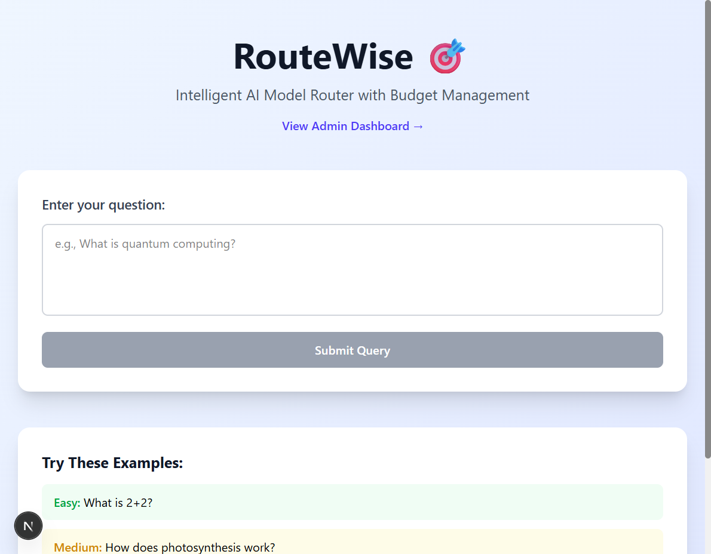
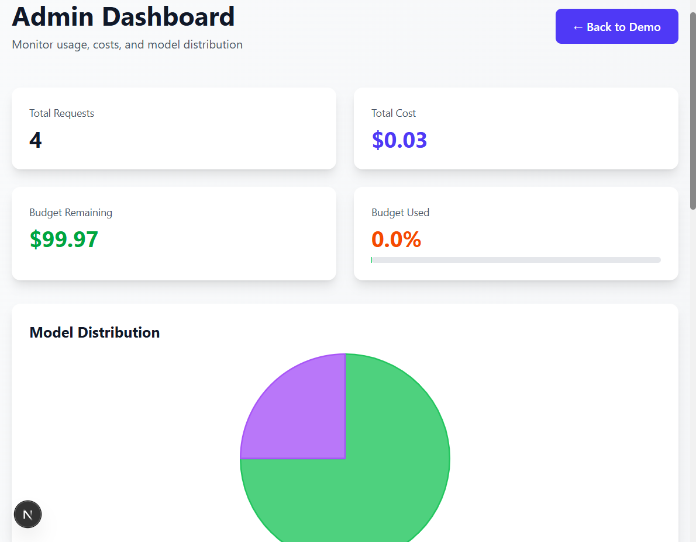

# RouteWise 🧠

An intelligent AI query router that automatically picks the right LLM model based on question complexity and budget constraints. Built to minimize costs without sacrificing quality.

## Screenshots

### Main Interface


### Admin Dashboard


## Why I Built This

I wanted to explore how to optimize AI costs in production. Most queries don't need GPT-4's power, but it's hard to know which ones do. This project routes simple questions to GPT-3.5 and reserves GPT-4 for complex analysis, tracking spending along the way.

## Features

- **Smart Routing**: Analyzes query difficulty and picks the right model
- **Budget Tracking**: Monthly spending limits with automatic throttling
- **Real-time Analytics**: See your usage patterns and cost breakdown
- **Simple Interface**: Clean chat UI to test the routing logic

## Tech Stack

- **Next.js** - React framework
- **TypeScript** - Type safety
- **Supabase** - PostgreSQL database for logging
- **OpenAI API** - GPT-3.5 and GPT-4 models
- **Chart.js** - Data visualization
- **Tailwind CSS** - Styling

## How It Works

1. User sends a query
2. System estimates difficulty (0.0 - 1.0) based on keywords and length
3. Selects model based on difficulty score and remaining budget
4. Logs the request with cost and tokens used
5. Returns the answer with metadata

### Routing Logic

- **Difficulty < 0.8**: Uses GPT-3.5 Turbo (cheap)
- **Difficulty ≥ 0.8**: Uses GPT-4 (expensive)
- **Budget > 90%**: Forces GPT-3.5 for most queries
- **Budget = 100%**: Blocks all requests

## Setup

### Prerequisites

- Node.js 18+
- OpenAI API key
- Supabase account

### Installation

1. Clone the repo
```bash
git clone https://github.com/mihir1708/route-wise.git
cd route-wise
```

2. Install dependencies
```bash
npm install
```

3. Set up environment variables
```bash
cp env.example .env.local
```

Edit `.env.local` with your actual keys:
- Get OpenAI key from https://platform.openai.com/api-keys
- Get Supabase credentials from your project settings

4. Set up the database

Run the SQL in `supabase-schema.sql` in your Supabase SQL editor to create the tables.

5. Run the development server
```bash
npm run dev
```

Open [http://localhost:3000](http://localhost:3000)

## Project Structure

```
route-wise/
├── lib/                      # Core logic
│   ├── difficulty-estimator.ts   # Query analysis
│   ├── budget-tracker.ts          # Cost tracking
│   ├── model-client.ts            # OpenAI wrapper
│   └── supabase.ts                # Database client
├── pages/
│   ├── api/
│   │   └── route-query.ts         # Main routing endpoint
│   ├── index.tsx                  # Chat interface
│   └── admin.tsx                  # Analytics dashboard
├── types/
│   └── index.ts                   # TypeScript definitions
└── utils/
    ├── pricing.ts                 # Model pricing data
    └── logger.ts                  # Logging utility
```

## Usage

### Main Interface
Go to the home page and start asking questions. The system will show you which model was used and how much it cost.

### Admin Dashboard
Visit `/admin` to see:
- Total spending this month
- Model usage distribution
- Recent query logs
- Cost trends over time

## Example Queries

**Easy (GPT-3.5):**
- "What is 2+2?"
- "Define machine learning"

**Medium (GPT-3.5):**
- "How does photosynthesis work?"
- "Why is the sky blue?"

**Hard (GPT-4):**
- "Explain quantum entanglement and its implications for quantum computing"
- "Analyze the causes of the 2008 financial crisis step-by-step"

## What I Learned

- Keyword-based difficulty estimation works surprisingly well for this use case
- 80% of queries really can be handled by cheaper models without quality loss
- Budget tracking is crucial - costs can spiral fast with GPT-4
- Logging everything from the start makes debugging and optimization way easier

## Future Improvements

- Add more model options (Claude, Gemini)
- Implement response caching for identical queries
- Use an LLM to estimate difficulty instead of keyword matching
- Add user authentication and per-user budgets
- A/B test different routing strategies
